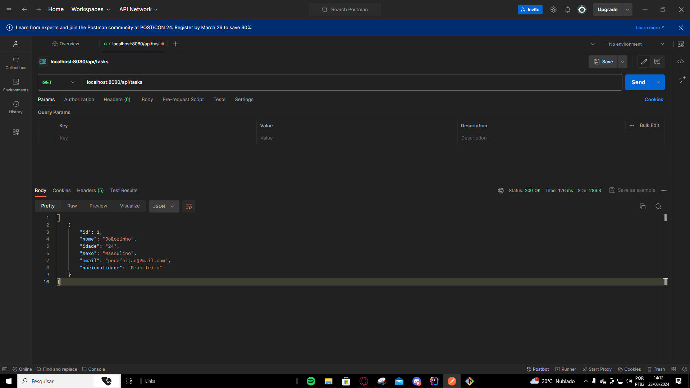

# Microserviço de Gerenciamento de Alunos

Este é um projeto de microserviço para gerenciar alunos em uma universidade, implementado com Spring Boot e JDBC Template para interação com o banco de dados.

## Descrição

Este microserviço é parte de uma aplicação maior que visa gerenciar todos os aspectos de uma universidade. Ele lida especificamente com as operações CRUD (Create, Read, Update, Delete) relacionadas aos alunos. Cada aluno possui os seguintes atributos: nome, idade, sexo, email e nacionalidade.

## Funcionalidades

- CRUD de alunos (Create, Read, Update, Delete)
- Pesquisa de alunos por diferentes critérios (nome, idade, sexo, email, nacionalidade)

## Requisitos

- Java 8 ou superior
- Banco de dados PostgreSQL
- IntelliJ IDEA (ou outra IDE de sua preferência)

## Prints Postman

