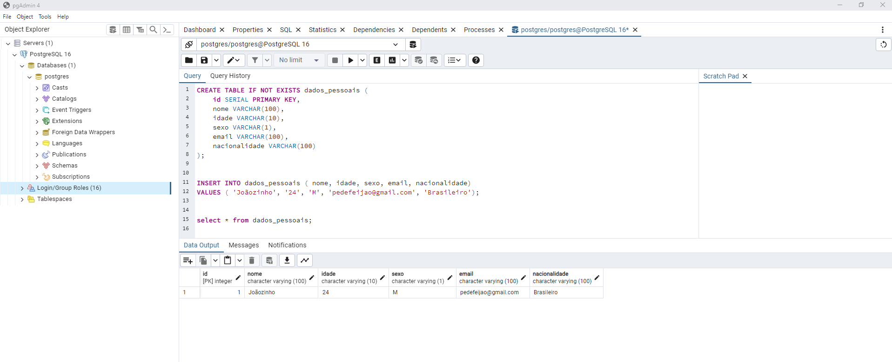

# Atualização do Microserviço de Alunos

Este é um projeto de atualização do microserviço de alunos para adicionar suporte a persistência de dados utilizando o PostgreSQL. As alterações foram feitas na branch `aula05`.

## Descrição

Este projeto é uma continuação do trabalho das últimas semanas, onde agora o foco é adicionar suporte a persistência de dados utilizando o PostgreSQL, além de implementar operações de remoção de registros e pesquisa por diferentes campos.

## Alterações Realizadas

- Adicionada dependência para PostgreSQL
- Configuração do banco de dados PostgreSQL no arquivo `application.properties`
- Implementação de operações CRUD para persistência de dados
- Adição de suporte para remoção de registros
- Implementação de métodos de pesquisa por diferentes campos (por exemplo, `findByNome`, `findByIdade`, `findBySexo`, etc.)
- Criação de endpoints para todas as consultas

## Estrutura do Projeto

A estrutura do projeto foi mantida conforme as versões anteriores, com a adição das operações de persistência de dados e pesquisa por diferentes campos:

- `src/main/java/joao/ac1/repository`: Pacote contendo as interfaces e implementações dos repositórios.
- `src/main/java/joao/ac1/service`: Pacote contendo as interfaces e implementações dos serviços.
- `src/main/java/joao/ac1/model`: Pacote contendo as classes de modelo.

## Requisitos

- Java 8 ou superior
- Banco de dados PostgreSQL
- IntelliJ IDEA (ou outra IDE de sua preferência)

## Prints PostgreSQL e Postman

